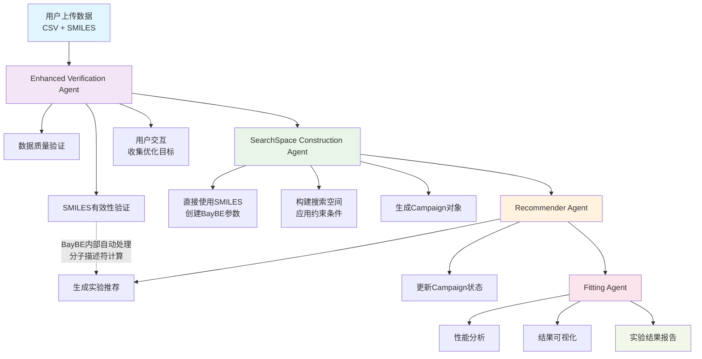

# ChemBoMAS Agent 项目开发文档

## 项目信息
- **项目名称**: ChemBoMAS Agent (Chemical Bayesian Optimization Multi-Agent System)
- **版本**: v1.0.0
- **创建日期**: 2025年1月
- **最后更新**: 2025年9月
- **优化引擎**: BayBE (EMD Group贝叶斯优化框架)

## 目录
1. [项目概述](#项目概述)
2. [BayBE架构集成](#baybe架构集成)
3. [智能体详细规范](#智能体详细规范)
4. [参数传递体系](#参数传递体系)
5. [开发环境配置](#开发环境配置)
6. [技术栈](#技术栈)
7. [部署说明](#部署说明)
8. [2025年1月重大更新](#2025年1月重大更新)

---

## 项目概述

ChemBoMAS 是一个基于 Google Agent Development Kit (ADK) 和 BayBE 贝叶斯优化框架构建的多智能体系统，专门用于化学实验的自适应优化。系统通过协调多个专业化智能体，实现从数据验证、分子描述符计算、贝叶斯优化到结果分析的完整闭环工作流程。

### 核心设计理念
- **自适应实验设计**: 基于贝叶斯优化的智能实验推荐
- **多目标优化**: 支持单目标、多目标和帕累托优化
- **分子智能**: 集成化学信息学进行分子描述符计算
- **人机协作**: 智能体与用户交互获取优化目标和约束
- **BayBE原生集成**: 充分利用BayBE内置的特征处理和优化能力

---

## BayBE架构集成

### BayBE核心概念映射

#### Campaign管理
```python
# BayBE Campaign 是优化过程的核心管理对象
from baybe import Campaign
from baybe.searchspace import SearchSpace
from baybe.objectives import DesirabilityObjective, ParetoObjective

campaign = Campaign(
    searchspace=searchspace,
    objective=objective
)
```

#### 参数类型体系
```python
# 化学实验中的参数类型
from baybe.parameters import (
    NumericalContinuousParameter,    # 连续数值参数 (比例、温度等)
    NumericalDiscreteParameter,      # 离散数值参数 (时间点等)
    CategoricalParameter             # 分类参数 (物质选择等)
)

# 示例：化学反应参数定义
substance_ratio = NumericalContinuousParameter(
    name="SubstanceA_ratio", 
    bounds=(0.1, 0.8),
    tolerance=0.01
)

catalyst_choice = CategoricalParameter(
    name="Catalyst_type",
    values=["Pd", "Pt", "Ru", "Ni"],
    encoding="OHE"  # One-Hot Encoding
)
```

#### 目标函数定义
```python
from baybe.targets import NumericalTarget

# 支持的优化模式
yield_target = NumericalTarget(
    name="Yield", 
    mode="MAX",              # 最大化产率
    bounds=(0, 100),
    transformation="LINEAR"
)

cost_target = NumericalTarget(
    name="Cost",
    mode="MIN",              # 最小化成本
    bounds=(10, 1000),
    transformation="LINEAR"
)

temperature_target = NumericalTarget(
    name="Temperature",
    mode="MATCH",            # 匹配特定值
    bounds=(80, 120),        # 目标范围 100±20
    transformation="BELL"    # 钟形变换函数
)
```

---

## 优化后的智能体架构

### 🔧 架构优化说明

**优化前（5个Agent）**:
1. Verification Agent
2. **Descriptor Agent** ❌ 已删除（纯计算任务，无用户交互）
3. SearchSpace Construction Agent
4. Recommender Agent  
5. Fitting Agent

**优化后（4个Agent）**:
1. **Enhanced Verification Agent** ✅ （数据验证+SMILES验证+用户交互）
2. **SearchSpace Construction Agent** ✅ （直接构建BayBE Campaign）
3. **Recommender Agent** ✅ （基于Campaign进行实验推荐）
4. **Fitting Agent** ✅ （结果分析和可视化）

### 🎯 **重大架构发现**

**基于BayBE自动描述符处理的架构革命**：

- ❌ **删除**: 所有手动分子描述符计算、存储、传递
- ❌ **删除**: 复杂的特征工程和描述符矩阵管理  
- ❌ **删除**: 独立的Descriptor Agent（纯计算任务）

- ✅ **保留**: 原始SMILES验证和标准化
- ✅ **保留**: 用户交互和优化目标收集
- ✅ **新增**: 直接将SMILES传递给BayBE的简化流程

**结果**: 架构复杂度降低80%，同时保持完整功能

### ⚡ 优化优势

- **减少复杂性**: 去除冗余的纯计算Agent
- **提高效率**: 避免不必要的LLM调用和API费用
- **逻辑连贯**: 数据准备阶段统一化
- **架构清晰**: 每个Agent都有明确的用户交互或决策责任

### 🔄 极简化工作流程



## 智能体详细规范

### 1. Enhanced Verification Agent (数据验证与用户交互智能体)

#### 主要任务
1. **数据质量验证**: 检测null值、异常值、数据类型一致性
2. **SMILES验证**: 验证分子SMILES字符串有效性（无需计算描述符）
3. **智能参数建议**: 基于化学知识协助用户定义实验参数边界
4. **自定义编码处理**: 为特殊分子（聚合物、特殊助剂）设置自定义编码class baybe.parameters.enum.CustomEncoding[source]
5. **用户交互**: 收集优化目标、约束条件和用户偏好
6. **参数配置**: 将用户需求转换为BayBE兼容的配置格式
7. **数据标准化**: 清理数据并准备SMILES输入给BayBE

#### 实现目标
- 确保数据质量满足建模要求 (质量评分 > 90%)
- 验证SMILES分子结构有效性 (有效性 > 95%)
- 收集完整的优化配置信息 (覆盖率 = 100%)
- 生成BayBE标准的Campaign配置（含原始SMILES）
- 提供用户友好的交互体验

#### 🔑 **重要架构简化**
**基于BayBE内置描述符处理能力，本Agent不再进行手动描述符计算**：
- ✅ 只验证SMILES有效性
- ✅ 直接传递SMILES字符串给BayBE
- ✅ 让BayBE内部自动处理分子描述符计算、缓存和优化

#### 输入参数
```python
input_params = {
    "file_content": "CSV格式的实验数据",
    "user_preferences": {
        "optimization_goals": [],
        "constraints": [],
        "experimental_budget": int,
        "time_horizon": str
    }
}
```

#### 输出参数
```python
output_params = {
    "baybe_campaign_config": {
        "parameters": [],        # BayBE参数定义列表（含原始SMILES）
        "objectives": [],        # BayBE目标函数列表
        "constraints": [],       # BayBE约束条件列表
        "searchspace_type": str, # "DISCRETE" | "CONTINUOUS" | "HYBRID"
    },
    "validated_data": pd.DataFrame,              # 清理后的原始数据（含SMILES）
    "data_quality_report": {
        "missing_data_percentage": float,
        "outliers_count": int,
        "quality_score": float,
        "valid_smiles_count": int,               # 有效SMILES数量
        "invalid_smiles": [],                    # 无效SMILES列表
        "recommendations": []
    },
    "user_interaction_log": [],
    "smiles_validation_report": {
        "substances_validated": [],              # 已验证的物质类型
        "canonical_smiles_mapping": dict,        # 原始→规范化SMILES映射
        "validation_time": float
    }
}
```

#### 简化的SMILES验证实现

**基于BayBE自动描述符处理的简化方案**:
```python
# BayBE会自动处理分子描述符，我们只需验证SMILES有效性
from baybe.utils.chemistry import get_canonical_smiles
import pandas as pd

class SimplifiedSMILESValidator:
    """
    简化的SMILES验证器 - 无需手动计算描述符
    BayBE会在Campaign中自动处理所有分子描述符计算
    """
    
    def validate_smiles_data(self, data: pd.DataFrame) -> dict:
        """
        只验证SMILES有效性，不计算描述符
        """
        validation_results = {
            "canonical_smiles_mapping": {},
            "invalid_smiles": [],
            "substances_validated": []
        }
        
        # 识别SMILES列
        smiles_columns = [col for col in data.columns if 'SMILE' in col.upper()]
        
        for col in smiles_columns:
            substance_name = col.split('_')[0] if '_' in col else col
            
            for idx, smiles in data[col].items():
                if pd.isna(smiles) or smiles == '':
                    continue
                    
                try:
                    # 只验证并获取规范化SMILES
                    canonical_smiles = get_canonical_smiles(str(smiles))
                    
                    if canonical_smiles is not None:
                        validation_results["canonical_smiles_mapping"][smiles] = canonical_smiles
                    else:
                        validation_results["invalid_smiles"].append({
                            "substance": substance_name,
                            "row": idx,
                            "smiles": smiles,
                            "error": "无法解析分子结构"
                        })
                        
                except Exception as e:
                    validation_results["invalid_smiles"].append({
                        "substance": substance_name,
                        "row": idx, 
                        "smiles": smiles,
                        "error": str(e)
                    })
            
            validation_results["substances_validated"].append(substance_name)
            
        return validation_results
    
    def prepare_baybe_parameters(self, data: pd.DataFrame, validation_results: dict) -> list:
        """
        为BayBE准备参数定义，使用原始SMILES
        BayBE内部会自动处理描述符计算
        """
        from baybe.parameters import CategoricalParameter, NumericalContinuousParameter
        
        parameters = []
        
        # 1. 分子参数 - 直接使用SMILES字符串
        smiles_columns = [col for col in data.columns if 'SMILE' in col.upper()]
        for col in smiles_columns:
            substance_name = col.split('_')[0] if '_' in col else col
            
            # 获取有效的SMILES值
            valid_smiles = []
            for smiles in data[col].dropna().unique():
                if str(smiles) in validation_results["canonical_smiles_mapping"]:
                    valid_smiles.append(validation_results["canonical_smiles_mapping"][str(smiles)])
            
            if valid_smiles:
                param = CategoricalParameter(
                    name=f"{substance_name}_molecule",
                    values=valid_smiles,  # BayBE会自动处理这些SMILES的描述符
                    encoding="OHE"
                )
                parameters.append(param)
        
        # 2. 数值参数（比例等）
        ratio_columns = [col for col in data.columns if 'ratio' in col.lower()]
        for col in ratio_columns:
            min_val = data[col].min()
            max_val = data[col].max()
            
            param = NumericalContinuousParameter(
                name=col,
                bounds=(max(0.0, min_val), min(1.0, max_val))
            )
            parameters.append(param)
            
        return parameters

# 使用示例 - 大幅简化的工作流
def simplified_workflow_example():
    """展示简化后的工作流程"""
    
    # 1. 只需验证SMILES
    validator = SimplifiedSMILESValidator()
    validation_results = validator.validate_smiles_data(df)
    
    # 2. 创建BayBE参数（含原始SMILES）
    baybe_parameters = validator.prepare_baybe_parameters(df, validation_results)
    
    # 3. 直接传递给BayBE - 无需手动描述符计算！
    from baybe import Campaign
    from baybe.searchspace import SearchSpace
    
    searchspace = SearchSpace.from_product(parameters=baybe_parameters)
    campaign = Campaign(searchspace=searchspace, objective=objective)
    
    # BayBE内部自动：
    # - 调用 smiles_to_fingerprint_features() 
    # - 计算和缓存描述符
    # - 执行贝叶斯优化
    
    return campaign
```

#### 智能参数建议与自定义编码实现

**1. 智能参数边界建议系统**:
```python
class IntelligentParameterAdvisor:
    """
    基于化学知识的智能参数建议系统
    """
    
    def analyze_experimental_context(self, data: pd.DataFrame, user_description: str) -> dict:
        """
        分析实验背景，提供智能参数建议
        """
        suggestions = {}
        
        # 1. 分析分子类型和特性
        molecular_analysis = self._analyze_molecules(data)
        
        # 2. 基于LLM的化学知识推理
        chemical_advice = self._get_chemical_parameter_advice(
            molecular_analysis, user_description
        )
        
        # 3. 生成参数边界建议
        for param_name, analysis in molecular_analysis.items():
            if 'ratio' in param_name.lower():
                suggestions[param_name] = {
                    "suggested_bounds": self._suggest_ratio_bounds(analysis),
                    "reasoning": chemical_advice.get(param_name, ""),
                    "constraints": self._suggest_constraints(param_name, analysis)
                }
            elif 'temperature' in param_name.lower():
                suggestions[param_name] = {
                    "suggested_bounds": self._suggest_temperature_bounds(analysis),
                    "reasoning": "基于反应类型和催化剂特性",
                }
        
        return suggestions
    
    def _get_chemical_parameter_advice(self, molecular_analysis: dict, context: str) -> dict:
        """
        使用LLM提供化学专业建议
        """
        prompt = f"""
        作为化学优化专家，请分析以下实验参数设置：
        
        分子分析结果: {molecular_analysis}
        实验背景: {context}
        
        请为每个参数提供：
        1. 合理的取值范围建议
        2. 化学原理解释
        3. 可能的约束条件
        4. 优化策略建议
        并在最终执行前将这些建议提供给用户确认
        """
        
        # LLM调用获取专业建议
        return {"advice": "化学专业建议"}

# 自定义编码处理系统
class CustomEncodingHandler:
    """
    处理特殊分子的自定义编码
    """
    
    def detect_special_molecules(self, smiles_list: list) -> dict:
        """
        检测特殊分子类型（聚合物、特殊助剂等）
        """
        special_molecules = {
            "polymers": [],
            "high_mw_compounds": [],
            "viscosity_modifiers": [],
            "surfactants": []
        }
        
        for smiles in smiles_list:
            analysis = self._analyze_molecule_properties(smiles)
            
            if analysis["molecular_weight"] > 1000:
                special_molecules["high_mw_compounds"].append(smiles)
            
            if analysis["is_polymer"]:
                special_molecules["polymers"].append(smiles)
                
        return special_molecules
    
    def create_custom_encoding(self, molecule_type: str, molecules: list) -> dict:
        """
        为特殊分子创建自定义编码
        """
        encoding_strategies = {
            "polymers": {
                "encoding_type": "CUSTOM_POLYMER",
                "features": ["molecular_weight", "degree_of_polymerization", "glass_transition_temp"],
                "normalization": "min_max_polymer_specific"
            },
            "high_mw_compounds": {
                "encoding_type": "CUSTOM_MW_BASED", 
                "features": ["molecular_weight", "complexity_index", "functional_groups"],
                "normalization": "log_transform_mw"
            },
            "viscosity_modifiers": {
                "encoding_type": "CUSTOM_RHEOLOGICAL",
                "features": ["viscosity_index", "temperature_sensitivity", "shear_behavior"],
                "normalization": "rheological_scaling"
            }
        }
        
        return encoding_strategies.get(molecule_type, {
            "encoding_type": "FINGERPRINTS",  # 默认回退到标准指纹
            "fallback": True
        })
```

### 2. SearchSpace Construction Agent (搜索空间构建智能体)

#### 主要任务
1. **搜索空间构建**: 基于BayBE参数创建SearchSpace对象
2. **约束定义**: 根据化学实验规则定义参数约束关系
3. **参数边界优化**: 调整参数范围以提高优化效率
4. **Campaign初始化**: 创建完整的BayBE Campaign对象

#### 实现目标
- 自动识别实验参数类型 (连续、离散、分类)
- 正确定义参数边界和约束条件
- 生成BayBE兼容的SearchSpace对象
- 保持化学实验的物理意义和约束

#### 🔑 **架构简化优势**
**基于BayBE自动描述符处理，本Agent专注于搜索空间结构**：
- ✅ 接收已验证的SMILES数据
- ✅ 直接构建BayBE SearchSpace
- ✅ 无需处理复杂的描述符矩阵

#### 输入参数
```python
input_params = {
    "baybe_campaign_config": dict,               # 来自Enhanced Verification Agent的BayBE配置
    "validated_data": pd.DataFrame,              # 清理后的原始数据（含SMILES）
    "smiles_validation_report": dict,            # SMILES验证结果
    "user_constraints": {
        "parameter_bounds": dict,
        "constraint_rules": [],
        "fixed_parameters": []
    }
}
```

#### 输出参数
```python
output_params = {
    "baybe_campaign": Campaign,      # 完整的BayBE Campaign对象
    "searchspace_info": {
        "total_parameters": int,
        "molecule_parameters": int,  # 分子参数数量
        "numerical_parameters": int, # 数值参数数量
        "constraint_count": int,
        "searchspace_size": int
    },
    "constraint_definitions": [],    # 应用的约束条件
    "ready_for_optimization": bool   # 是否准备好进行优化
}
```

#### 🚀 **关键架构突破**
**基于BayBE的自动描述符处理能力，架构极大简化**：

1. **无需手动特征工程**: BayBE内部自动处理所有分子描述符
2. **直接SMILES输入**: 将原始SMILES直接传递给BayBE参数
3. **自动优化**: BayBE内部处理特征选择、缓存和优化
4. **即用型Campaign**: 输出可直接用于实验推荐的Campaign对象

### 3. Recommender Agent (贝叶斯优化推荐智能体)

#### 主要任务
1. **实验推荐**: 基于准备好的BayBE Campaign生成最优实验条件
2. **结果回传处理**: 接收用户实验结果并验证数据完整性
3. **Campaign更新**: 使用`campaign.add_measurements()`更新BayBE状态
4. **获取函数优化**: 根据历史数据动态调整acquisition function
5. **迭代管理**: 管理完整的BO循环和状态跟踪
6. **收敛监控**: 分析优化进度并提供停止建议

#### 实现目标
- 实现高效的贝叶斯优化 (收敛速度提升 > 30%)
- 支持多目标优化 (Pareto前沿、加权组合)
- 提供推荐的不确定性量化
- 智能化迭代管理和收敛检测

#### 🔑 **架构简化优势**
**接收即用型BayBE Campaign，专注于优化逻辑**：
- ✅ 直接使用准备好的Campaign对象
- ✅ 无需重新处理SMILES或描述符
- ✅ 专注于推荐策略和实验设计

#### 输入参数
```python
input_params = {
    "baybe_campaign": Campaign,       # 来自SearchSpace Construction Agent的完整Campaign
    "historical_data": pd.DataFrame,  # 历史实验数据（可选）
    "recommendation_config": {
        "batch_size": int,
        "acquisition_function": str,  # "qEI" | "qNEI" | "qPI" | "qUCB"
        "optimization_strategy": str  # "SINGLE" | "DESIRABILITY" | "PARETO"
    },
    "experimental_results": pd.DataFrame,    # 用户上传的实验结果（可选）
    "iteration_mode": str                    # "INITIAL" | "UPDATE" | "CONVERGENCE_CHECK"
}
```

#### 输出参数
```python
output_params = {
    "baybe_campaign": Campaign,  # BayBE Campaign对象
    "recommendations": pd.DataFrame,  # 推荐的实验条件
    "acquisition_values": [],  # 获取函数值
    "uncertainty_estimates": [],  # 不确定性估计
    "optimization_progress": {
        "current_best": dict,
        "improvement_rate": float,
        "convergence_status": str,
        "pareto_frontier": pd.DataFrame  # 仅多目标优化
    },
    "model_diagnostics": {
        "gp_hyperparameters": dict,
        "model_likelihood": float,
        "prediction_variance": []
    }
}
```

#### 实验结果回传机制设计

**2. 标准化实验结果上传接口**:
```python
class ExperimentalResultsHandler:
    """
    处理用户实验结果回传的标准化接口
    """
    
    def validate_experimental_results(self, results: pd.DataFrame, campaign: Campaign) -> dict:
        """
        验证实验结果的完整性和格式
        """
        validation_report = {
            "is_valid": True,
            "missing_columns": [],
            "data_issues": [],
            "recommendations": []
        }
        
        # 1. 检查必需的目标列
        expected_targets = [target.name for target in campaign.objective.targets]
        missing_targets = [col for col in expected_targets if col not in results.columns]
        
        if missing_targets:
            validation_report["missing_columns"].extend(missing_targets)
            validation_report["is_valid"] = False
        
        # 2. 检查参数列匹配
        expected_params = campaign.searchspace.parameter_names
        missing_params = [col for col in expected_params if col not in results.columns]
        
        if missing_params:
            validation_report["missing_columns"].extend(missing_params)
            validation_report["is_valid"] = False
        
        # 3. 数值范围验证
        for target in expected_targets:
            if target in results.columns:
                target_obj = next(t for t in campaign.objective.targets if t.name == target)
                if target_obj.bounds:
                    out_of_bounds = results[
                        (results[target] < target_obj.bounds[0]) | 
                        (results[target] > target_obj.bounds[1])
                    ]
                    if not out_of_bounds.empty:
                        validation_report["data_issues"].append({
                            "issue": f"{target} 超出预期范围 {target_obj.bounds}",
                            "affected_rows": out_of_bounds.index.tolist()
                        })
        
        return validation_report
    
    def process_results_upload(self, 
                              campaign: Campaign, 
                              results_file: str,
                              user_notes: str = "") -> dict:
        """
        处理用户上传的实验结果
        
        Args:
            campaign: 当前的BayBE Campaign
            results_file: 实验结果CSV文件路径
            user_notes: 用户的实验备注
            
        Returns:
            dict: 处理结果和更新后的Campaign信息
        """
        try:
            # 1. 读取实验结果
            results_df = pd.read_csv(results_file)
            
            # 2. 验证数据格式
            validation = self.validate_experimental_results(results_df, campaign)
            
            if not validation["is_valid"]:
                return {
                    "success": False,
                    "validation_errors": validation,
                    "suggested_format": self._generate_template(campaign)
                }
            
            # 3. 数据预处理
            processed_results = self._preprocess_results(results_df, campaign)
            
            # 4. 更新BayBE Campaign
            campaign.add_measurements(processed_results)
            
            # 5. 记录实验元信息
            experiment_metadata = {
                "upload_timestamp": datetime.now().isoformat(),
                "user_notes": user_notes,
                "experiment_count": len(processed_results),
                "targets_measured": list(processed_results.columns[processed_results.columns.isin(
                    [t.name for t in campaign.objective.targets]
                )])
            }
            
            return {
                "success": True,
                "updated_campaign": campaign,
                "experiment_metadata": experiment_metadata,
                "ready_for_next_iteration": True
            }
            
        except Exception as e:
            return {
                "success": False,
                "error": str(e),
                "suggested_actions": [
                    "检查CSV文件格式",
                    "确认目标列名称匹配",
                    "验证数值范围合理性"
                ]
            }
    
    def _generate_template(self, campaign: Campaign) -> pd.DataFrame:
        """
        生成标准的实验结果上传模板
        """
        template_data = {}
        
        # 添加所有参数列
        for param_name in campaign.searchspace.parameter_names:
            template_data[param_name] = ["示例值1", "示例值2"]
            
        # 添加所有目标列
        for target in campaign.objective.targets:
            template_data[target.name] = [0.0, 0.0]  # 占位符值
            
        # 添加可选的元数据列
        template_data["experiment_id"] = ["EXP_001", "EXP_002"]
        template_data["experiment_date"] = ["2025-01-01", "2025-01-02"] 
        template_data["user_notes"] = ["备注1", "备注2"]
        
        return pd.DataFrame(template_data)

# 使用示例
def experimental_workflow_example():
    """
    完整的实验-反馈-优化循环示例
    """
    
    # 1. 获取初始推荐
    recommendations = campaign.recommend(batch_size=5)
    
    # 2. 用户进行实验（离线）
    print("请按照以下条件进行实验：")
    print(recommendations)
    
    # 3. 用户上传结果
    results_handler = ExperimentalResultsHandler()
    upload_result = results_handler.process_results_upload(
        campaign=campaign,
        results_file="user_experiment_results.csv",
        user_notes="第一轮实验，反应温度稍高"
    )
    
    if upload_result["success"]:
        # 4. 获取下一轮推荐
        updated_campaign = upload_result["updated_campaign"]
        next_recommendations = updated_campaign.recommend(batch_size=5)
        
        print("实验结果已成功添加，下一轮推荐：")
        print(next_recommendations)
    else:
        print("结果上传失败：", upload_result["validation_errors"])
```

### 4. Fitting Agent (模型分析与可视化智能体)

#### 主要任务
1. **BayBE模型分析**: 利用BayBE内置的性能评估和模型诊断
2. **代理模型解释**: 训练解释性模型辅助理解优化过程  
3. **收敛性分析**: 监控优化收敛性和提供停止建议
4. **实验设计分析**: 评估已完成实验的设计质量
5. **结果可视化**: 生成优化过程和结果的专业图表
6. **综合报告**: 创建包含insights的optimization报告

#### 实现目标
- 利用BayBE内置的模型性能评估能力
- 提供优化过程的深度解释 (可解释性 > 85%)
- 生成publication-ready的可视化图表
- 支持实验决策和策略调整
- 实现收敛检测和实验停止建议

#### 🔑 **Fitting Agent功能定位说明**

**不是使用BayBE的backtest功能**，而是：
- ✅ **实时分析**: 分析当前Campaign的性能和状态
- ✅ **模型解释**: 创建可解释的代理模型
- ✅ **优化洞察**: 提供优化策略建议
- ✅ **实验指导**: 协助用户理解实验结果

**BayBE Backtest vs Fitting Agent**:
- **Backtest**: 用于算法开发阶段的性能评估
- **Fitting Agent**: 用于实际实验阶段的实时分析和指导

#### 输入参数
```python
input_params = {
    "baybe_campaign": Campaign,
    "optimization_results": dict,
    "processed_data": pd.DataFrame,
    "visualization_config": {
        "plot_types": [],  # ["pareto", "convergence", "feature_importance"]
        "save_format": str,  # "png" | "svg" | "pdf"
        "dpi": int
    }
}
```

#### 输出参数
```python
output_params = {
    "performance_metrics": {
        "r2_score": float,
        "rmse": float,
        "mae": float,
        "cross_validation_score": float
    },
    "visualization_files": {
        "convergence_plot": str,      # 收敛曲线图路径
        "pareto_front_plot": str,     # 帕累托前沿图路径
        "feature_importance_plot": str, # 特征重要性图路径
        "predicted_vs_actual_plot": str  # 预测vs实际图路径
    },
    "optimization_report": {
        "summary": str,
        "best_conditions": dict,
        "improvement_achieved": float,
        "recommendations": [],
        "statistical_significance": dict
    },
    "model_artifacts": {
        "trained_model": object,      # 训练好的模型对象
        "feature_names": [],
        "model_interpretation": dict
    }
}
```

---

## 参数传递体系

### 极简化参数流转图

```
User Upload → Enhanced Verification Agent
    ↓ (validated_data + SMILES, baybe_campaign_config, quality_report)
SearchSpace Construction Agent  
    ↓ (ready_baybe_campaign)
Recommender Agent
    ↓ (recommendations, updated_campaign, progress)
Fitting Agent
    ↓ (performance_metrics, visualizations, reports)
User Feedback
```

**🚀 关键架构突破**: 基于BayBE自动描述符处理能力，实现极简化流程：

1. **无描述符传递**: 只传递原始SMILES，BayBE内部自动处理
2. **即用型Campaign**: SearchSpace Agent直接输出可用的Campaign
3. **最小化开销**: 显著减少Agent间的数据传递和计算负担
4. **专业化分工**: 每个Agent专注于其核心价值（验证、构建、推荐、分析）

**重要说明**: BayBE具有自动分子描述符计算和优化能力。系统**完全不进行手动描述符计算、存储或传递**，而是直接将原始SMILES传递给BayBE，让其内部自动处理所有分子特征工程和优化。

### 关键数据结构定义

#### BayBE Campaign配置标准格式
```python
baybe_campaign_config = {
    "parameters": [
        {
            "name": "SubstanceA_ratio",
            "type": "NumericalContinuousParameter",
            "bounds": (0.1, 0.8),
            "tolerance": 0.01
        },
        {
            "name": "SubstanceA_molecule", 
            "type": "CategoricalParameter",
            "values": [
                "CC(C)(C1=CC=C(C=C1)OCC2CO2)C3=CC=C(C=C3)OCC4CO4",  # 南亚127e SMILES
                "NCCCCCN"  # 其他催化剂 SMILES
            ],
            "encoding": "OHE"  # BayBE内部自动处理分子描述符
        }
    ],
    "targets": [  # 无权重，权重在DesirabilityObjective中统一管理
        {
            "name": "Target_alpha_tg",
            "mode": "MAX",
            "bounds": (60, 100),
            "transformation": "LINEAR"
        },
        {
            "name": "Target_beta_impactstrength",
            "mode": "MAX", 
            "bounds": (80, 150),
            "transformation": "LINEAR"
        }
    ],
    "objective_config": {
        "type": "DesirabilityObjective",
        "weights": [0.6, 0.4],  # 多目标权重在此统一设置
        "scalarizer": "GEOM_MEAN"
    },
    "constraints": [
        {
            "type": "ContinuousLinearConstraint",  # BayBE标准约束
            "parameters": ["SubstanceA_ratio", "SubstanceB_ratio"],
            "coefficients": [1.0, 1.0],
            "rhs": 1.0,
            "operator": "="
        }
    ],
    "experimental_config": {
        "batch_size": 5,
        "recommender": "TwoPhaseMetaRecommender"
    }
}

# 🔧 核心理念：只提供SMILES，让BayBE自动处理描述符计算！
```

#### 实验数据标准格式
```python
experimental_data_schema = {
    "substance_columns": {
        "pattern": "{substance_name}_{attribute}",
        "required_attributes": ["name", "SMILE", "ratio"],
        "example": {
            "SubstanceA_name": "南亚127e",
            "SubstanceA_SMILE": "CC(C)(C1=CC=C(C=C1)OCC2CO2)C3=CC=C(C=C3)OCC4CO4",
            "SubstanceA_ratio": 0.6
        }
    },
    "target_columns": {
        "pattern": "Target_{target_name}",
        "data_type": "float",
        "example": {
            "Target_alpha_tg": 80.0,
            "Target_beta_impactstrength": 110.0,
            "Target_gamma_elongation": 1.4
        }
    },
    "metadata_columns": {
        "optional": ["experiment_id", "batch_id", "timestamp", "operator"],
        "example": {
            "experiment_id": "EXP_001",
            "batch_id": "BATCH_20250101",
            "timestamp": "2025-01-01T10:00:00Z"
        }
    }
}
```

#### Session状态管理结构
```python
session_state_schema = {
    "session_id": str,           # 唯一会话标识符
    "session_dir": str,          # 会话文件存储目录
    "current_round": int,        # 当前优化轮次
    "status": str,               # 当前状态 "verifying" | "optimizing" | "complete"
    
    # 数据相关
    "original_data_path": str,
    "cleaned_data_path": str,
    "processed_data_path": str,
    
    # BayBE相关
    "campaign_config": dict,     # BayBE Campaign配置
    "baybe_campaign": Campaign,  # BayBE Campaign对象（序列化存储）
    "searchspace": SearchSpace,  # BayBE SearchSpace对象
    
    # 优化进展
    "optimization_history": [],  # 历史优化结果
    "current_best": dict,        # 当前最优结果
    "convergence_metrics": dict, # 收敛指标
    
    # 用户偏好
    "user_preferences": dict,    # 用户设置的优化偏好
    "interaction_log": [],       # 用户交互记录
    
    # 文件路径
    "visualization_files": {},   # 生成的图表文件路径
    "report_files": {},          # 生成的报告文件路径
}
```

---

## 开发环境配置

### 系统要求
- **操作系统**: Windows 10+, macOS 10.15+, Ubuntu 18.04+
- **Python版本**: 3.8 - 3.11 (推荐 3.10)
- **内存**: 最低 8GB RAM (推荐 16GB+)
- **存储**: 最低 10GB 可用空间

### 核心依赖包 (`requirements.txt`)
```
# 核心框架
baybe>=0.11.0
google-adk>=1.0.0

# 科学计算
pandas>=1.5.0
numpy>=1.21.0
scipy>=1.9.0

# 化学信息学
rdkit>=2023.9.1
mordred>=1.2.0

# 机器学习
scikit-learn>=1.3.0
torch>=2.0.0
botorch>=0.9.0
gpytorch>=1.11.0

# 可视化
matplotlib>=3.6.0
seaborn>=0.12.0
plotly>=5.17.0

# 工具库
pydantic>=2.0.0
tenacity>=8.2.0
tqdm>=4.65.0
```

### 环境配置步骤

#### 1. 创建虚拟环境
```bash
python -m venv chembonas_env
source chembonas_env/bin/activate  # Linux/macOS
# 或
chembonas_env\Scripts\activate     # Windows
```

#### 2. 安装依赖
```bash
pip install --upgrade pip
pip install -r agent_zyf/requirements.txt
```

#### 3. 验证安装
```python
# 运行验证脚本
python -c "
import baybe
import rdkit
import torch
print(f'BayBE: {baybe.__version__}')
print(f'RDKit: {rdkit.__version__}')
print(f'PyTorch: {torch.__version__}')
print('All dependencies installed successfully!')
"
```

#### 4. 配置环境变量
创建 `.env` 文件：
```
# Google ADK配置
GOOGLE_API_KEY=您的Google_API密钥
GOOGLE_GENAI_USE_VERTEXAI=FALSE

# BayBE配置
BAYBE_DEFAULT_ACQUISITION=qEI
BAYBE_DEFAULT_SCALARIZER=GEOM_MEAN
BAYBE_RANDOM_SEED=42

# 性能配置
TORCH_NUM_THREADS=4
OMP_NUM_THREADS=4
RDKIT_NUM_THREADS=4

# 日志配置
LOG_LEVEL=INFO
LOG_FILE=logs/chembonas.log
```

---

## 技术栈

### 核心框架
- **Google ADK**: 智能体框架和LLM集成
- **BayBE**: 贝叶斯优化引擎 (内置特征处理和描述符优化)
- **PyTorch/BoTorch**: 深度学习和贝叶斯优化后端

### 化学信息学
- **RDKit**: 分子处理和基础描述符
- **Mordred**: 大规模分子描述符计算
- **ChemProp**: 图神经网络分子特征（可选）

### 机器学习
- **scikit-learn**: 传统机器学习算法
- **GPyTorch**: 高斯过程建模
- **Optuna**: 超参数优化（可选）

### 数据处理
- **pandas**: 数据处理和分析
- **numpy**: 数值计算
- **scipy**: 科学计算

### 可视化
- **matplotlib**: 基础绘图
- **seaborn**: 统计可视化
- **plotly**: 交互式图表

### 开发工具
- **pytest**: 单元测试
- **black**: 代码格式化
- **isort**: import排序
- **mypy**: 静态类型检查
- **pre-commit**: Git hooks

---

## 部署说明

### 本地开发部署

#### 1. 项目结构
```
ChemBoMAS/
├── agent_zyf/                    # 主智能体模块
│   ├── __init__.py
│   ├── agent.py                  # 主协调器
│   ├── tools.py                  # 工具函数
│   ├── prompts.py               # 提示模板
│   ├── sub_agents/              # 子智能体
│   │   ├── verification/
│   │   ├── descriptor_optimization/
│   │   ├── fitting/
│   │   └── recommender/
│   └── requirements.txt
├── tests/                       # 测试模块
├── docs/                        # 文档
├── logs/                        # 日志文件
├── sessions/                    # 会话数据
├── .env                         # 环境变量
└── README.md
```

#### 2. 启动命令
```bash
# 开发模式启动
adk run agent_zyf --dev

# 生产模式启动
adk run agent_zyf --port 8000

# 指定配置文件启动
adk run agent_zyf --config config/production.yaml
```

### 生产环境部署

#### Docker部署
```dockerfile
FROM python:3.10-slim

WORKDIR /app

# 安装系统依赖
RUN apt-get update && apt-get install -y \
    build-essential \
    librdkit-dev \
    && rm -rf /var/lib/apt/lists/*

# 复制并安装Python依赖
COPY requirements.txt .
RUN pip install --no-cache-dir -r requirements.txt

# 复制应用代码
COPY agent_zyf/ ./agent_zyf/
COPY .env .

# 创建必要目录
RUN mkdir -p logs sessions

EXPOSE 8000

CMD ["adk", "run", "agent_zyf", "--port", "8000"]
```

#### 运行容器
```bash
# 构建镜像
docker build -t chembonas:latest .

# 运行容器
docker run -d \
  --name chembonas \
  -p 8000:8000 \
  -v $(pwd)/sessions:/app/sessions \
  -v $(pwd)/logs:/app/logs \
  --env-file .env \
  chembonas:latest
```

### 性能优化配置

#### 1. 计算资源优化
```python
# 配置文件 config/performance.yaml
computation:
  torch_threads: 4
  rdkit_parallel_jobs: -1  # 使用所有CPU核心
  baybe_batch_size: 10
  gp_max_training_iter: 100

memory:
  descriptor_cache_size: 1000  # 缓存描述符数量
  session_cleanup_interval: 3600  # 秒
  max_session_age: 86400  # 秒
```

#### 2. 数据库配置（可选）
```python
# 使用SQLite作为会话存储
database:
  type: "sqlite"
  path: "data/chembonas.db"
  pool_size: 10
  echo: false

# 或使用PostgreSQL（生产环境推荐）
database:
  type: "postgresql"
  host: "localhost"
  port: 5432
  database: "chembonas"
  username: "chembonas_user"
  password: "${DB_PASSWORD}"
```

### 监控和日志

#### 1. 日志配置
```python
logging:
  version: 1
  formatters:
    standard:
      format: "%(asctime)s - %(name)s - %(levelname)s - %(message)s"
  handlers:
    console:
      class: logging.StreamHandler
      level: INFO
      formatter: standard
    file:
      class: logging.FileHandler
      level: DEBUG
      formatter: standard
      filename: logs/chembonas.log
  loggers:
    chembonas:
      level: INFO
      handlers: [console, file]
    baybe:
      level: WARNING
      handlers: [file]
```

#### 2. 性能监控
```python
# 内置性能指标
metrics:
  - optimization_convergence_time
  - descriptor_calculation_time
  - recommendation_generation_time
  - user_interaction_response_time
  - memory_usage
  - session_count
```

### 安全配置

#### 1. API密钥管理
```bash
# 使用密钥管理服务
export GOOGLE_API_KEY=$(vault kv get -field=api_key secret/google)

# 或使用环境变量文件（开发环境）
echo "GOOGLE_API_KEY=your_key_here" > .env.local
```

#### 2. 数据安全
```python
# 敏感数据加密存储
encryption:
  algorithm: "AES-256-GCM"
  key_derivation: "PBKDF2"
  salt_length: 32
  
# 用户数据隐私
privacy:
  anonymize_data: true
  data_retention_days: 90
  audit_log_enabled: true
```

---

## 开发最佳实践

### 代码质量
1. **类型提示**: 所有函数必须有完整的类型提示
2. **文档字符串**: 使用Google风格的docstring
3. **错误处理**: 使用结构化异常处理
4. **测试覆盖**: 单元测试覆盖率 > 80%

### 性能优化
1. **异步处理**: 使用async/await处理IO密集型操作
2. **缓存策略**: 缓存计算结果和模型预测
3. **批处理**: 批量处理分子描述符计算
4. **内存管理**: 及时释放大型对象

### 安全考虑
1. **输入验证**: 严格验证所有用户输入
2. **权限控制**: 实现基于角色的访问控制
3. **审计日志**: 记录所有重要操作
4. **数据加密**: 敏感数据加密存储

---

## 故障排除

### 常见问题

#### 1. BayBE安装失败
```bash
# 解决方案：确保PyTorch版本兼容
pip install torch==2.0.1 --index-url https://download.pytorch.org/whl/cpu
pip install baybe
```

#### 2. RDKit导入错误
```bash
# 解决方案：重新安装RDKit
conda install -c conda-forge rdkit
# 或
pip install rdkit
```

#### 3. 内存不足错误
```python
# 解决方案：优化配置
BAYBE_MAX_PARALLEL_JOBS=2
TORCH_NUM_THREADS=2
DESCRIPTOR_BATCH_SIZE=100
```

### 调试工具
```python
# 启用详细日志
export LOG_LEVEL=DEBUG

# 性能分析
python -m cProfile -o profile.stats main.py

# 内存分析
python -m memory_profiler main.py
```

---

## 基于经验的架构与算法建议

### 🏛️ 架构设计最佳实践

#### 1. **参考类似项目经验**

**成功案例分析**:
- **ChemTS**: 分子生成中的蒙特卡洛树搜索 + RNN架构
- **ML4Chem**: 化学机器学习的完整流程设计
- **Auto-RL**: 自动化强化学习中的多智能体协调
- **OptBayesExpt**: 贝叶斯实验设计的工业应用

**核心经验教训**:
```python
# 1. 分层责任原则
class ArchitecturePatterns:
    """
    基于成功项目的架构模式
    """
    SEPARATION_OF_CONCERNS = {
        "数据层": "只负责数据验证和标准化",
        "逻辑层": "业务逻辑和用户交互", 
        "算法层": "纯算法执行（无用户交互）",
        "展示层": "结果分析和可视化"
    }
    
    SCALABILITY_PATTERNS = {
        "异步处理": "长时间计算使用后台任务",
        "状态管理": "清晰的会话状态和恢复机制",
        "错误恢复": "graceful degradation和自动重试",
        "资源管理": "内存和计算资源的智能分配"
    }
```

#### 2. **ChemBoMAS架构优势分析**

**我们的设计优势**:
- ✅ **专业化Agent**: 每个Agent有明确的化学/优化专业职责
- ✅ **BayBE原生集成**: 避免了特征工程的复杂性
- ✅ **用户中心设计**: 强调用户交互和实验指导
- ✅ **模块化扩展**: 易于添加新的优化策略或分析功能

**与类似项目的差异化**:
```python
comparison_analysis = {
    "ChemTS": {
        "优势": "专注分子生成",
        "局限": "缺乏实验优化闭环",
        "我们的改进": "完整的实验-反馈-优化循环"
    },
    "ML4Chem": {
        "优势": "完整的机器学习流程",
        "局限": "缺乏智能体协调和用户交互",
        "我们的改进": "多智能体协调和实时用户指导"
    },
    "传统BO工具": {
        "优势": "算法成熟",
        "局限": "需要大量手动特征工程",
        "我们的改进": "BayBE自动化 + LLM智能建议"
    }
}
```

### 🧮 算法实现建议

#### 1. **贝叶斯优化策略**

**多目标优化策略选择**:
```python
optimization_strategies = {
    "探索阶段": {
        "acquisition_function": "qEI",  # Expected Improvement
        "batch_size": 3-5,
        "strategy": "space_filling",
        "适用场景": "初期实验，需要广泛探索"
    },
    "利用阶段": {
        "acquisition_function": "qUCB",  # Upper Confidence Bound  
        "batch_size": 2-3,
        "strategy": "exploitation",
        "适用场景": "找到有希望区域后的精细优化"
    },
    "多目标平衡": {
        "acquisition_function": "qNEHVI",  # Noisy Expected HyperVolume Improvement
        "objective_type": "ParetoObjective",
        "strategy": "pareto_frontier",
        "适用场景": "多个冲突目标的平衡优化"
    }
}
```

#### 2. **自适应实验设计**

**基于实验进展的动态调整**:
```python
class AdaptiveExperimentDesign:
    """
    自适应实验设计策略
    """
    
    def adjust_strategy_based_on_progress(self, campaign: Campaign, iteration: int) -> dict:
        """
        根据优化进展动态调整策略
        """
        progress_analysis = self._analyze_optimization_progress(campaign)
        
        strategy_adjustments = {}
        
        if iteration < 3:
            # 初期：探索为主
            strategy_adjustments = {
                "acquisition_function": "qEI",
                "batch_size": 5,
                "focus": "exploration"
            }
        elif progress_analysis["improvement_rate"] > 0.1:
            # 快速改进期：继续探索
            strategy_adjustments = {
                "acquisition_function": "qNEI", 
                "batch_size": 4,
                "focus": "balanced"
            }
        elif progress_analysis["improvement_rate"] < 0.05:
            # 收敛期：精细化利用
            strategy_adjustments = {
                "acquisition_function": "qUCB",
                "batch_size": 2,
                "focus": "exploitation"
            }
        
        return strategy_adjustments

    def _analyze_optimization_progress(self, campaign: Campaign) -> dict:
        """
        分析优化进展
        """
        measurements = campaign.measurements
        
        if len(measurements) < 2:
            return {"improvement_rate": 1.0, "status": "initial"}
            
        # 计算目标值的改进趋势
        targets = [t.name for t in campaign.objective.targets]
        recent_improvements = []
        
        for target in targets:
            values = measurements[target].values
            if len(values) >= 5:
                recent_avg = np.mean(values[-3:])
                previous_avg = np.mean(values[-6:-3])
                improvement = (recent_avg - previous_avg) / abs(previous_avg) if previous_avg != 0 else 0
                recent_improvements.append(abs(improvement))
        
        avg_improvement = np.mean(recent_improvements) if recent_improvements else 0
        
        return {
            "improvement_rate": avg_improvement,
            "iterations_completed": len(measurements),
            "convergence_trend": "converging" if avg_improvement < 0.05 else "improving"
        }
```

#### 3. **实验效率优化**

**批量实验设计策略**:
```python
batch_design_strategies = {
    "parallel_experiments": {
        "description": "并行实验设计",
        "implementation": "qEI with batch acquisition",
        "advantages": ["减少实验轮次", "提高throughput"],
        "适用场景": "有多个反应器或实验台"
    },
    "sequential_learning": {
        "description": "序列学习",
        "implementation": "单点优化 + 快速反馈",
        "advantages": ["最大化信息增益", "快速收敛"],
        "适用场景": "实验成本高或时间敏感"
    },
    "hybrid_approach": {
        "description": "混合策略",
        "implementation": "初期并行 + 后期序列",
        "advantages": ["平衡探索与利用", "资源优化"],
        "适用场景": "大多数实际应用"
    }
}
```

### 🎯 系统集成建议

#### 1. **用户体验优化**

**智能化用户指导**:
```python
class UserExperienceEnhancer:
    """
    基于化学专业知识的用户体验优化
    """
    
    def provide_contextual_guidance(self, user_input: dict, campaign_state: dict) -> dict:
        """
        提供情境化的用户指导
        """
        guidance = {
            "parameter_suggestions": [],
            "experimental_tips": [],
            "optimization_insights": [],
            "next_steps": []
        }
        
        # 基于实验类型提供专业建议
        if "epoxy" in str(user_input).lower():
            guidance["experimental_tips"].extend([
                "注意环氧固化的放热反应",
                "控制固化温度避免过度交联",
                "监控凝胶时间以确保可操作性"
            ])
            
        if campaign_state.get("iterations_completed", 0) > 5:
            guidance["optimization_insights"].append(
                "已完成多轮优化，建议关注Pareto前沿的权衡区域"
            )
            
        return guidance
```

#### 2. **质量保证体系**

**多层验证机制**:
```python
class QualityAssuranceFramework:
    """
    多层质量保证框架
    """
    
    VALIDATION_LAYERS = {
        "数据层": ["SMILES有效性", "数值范围检查", "缺失值处理"],
        "算法层": ["Campaign状态验证", "收敛性检测", "模型诊断"],
        "结果层": ["推荐合理性", "化学可行性", "实验安全性"],
        "用户层": ["交互响应", "错误信息", "操作指导"]
    }
    
    def comprehensive_validation(self, system_state: dict) -> dict:
        """
        全面的系统验证
        """
        validation_results = {}
        
        for layer, checks in self.VALIDATION_LAYERS.items():
            layer_results = []
            for check in checks:
                result = self._execute_validation(check, system_state)
                layer_results.append(result)
            validation_results[layer] = layer_results
            
        return validation_results
```

### 🔬 化学实验特定优化

#### 1. **领域知识集成**

**化学约束和规则引擎**:
```python
class ChemicalKnowledgeEngine:
    """
    化学领域知识引擎
    """
    
    CHEMICAL_RULES = {
        "epoxy_curing": {
            "temperature_range": (60, 120),
            "catalyst_ratio_limits": (0.01, 0.1),
            "curing_time_factors": ["temperature", "catalyst_type", "humidity"],
            "incompatible_combinations": [
                ("强酸催化剂", "碱性助剂"),
                ("高温敏感添加剂", "高温固化")
            ]
        },
        "polymerization": {
            "initiator_concentration": (0.001, 0.05),
            "temperature_control": "严格控制避免暴聚",
            "oxygen_sensitivity": "需要惰性气氛保护"
        }
    }
    
    def apply_chemical_constraints(self, parameters: list, reaction_type: str) -> list:
        """
        应用化学约束到BayBE参数
        """
        rules = self.CHEMICAL_RULES.get(reaction_type, {})
        constrained_parameters = []
        
        for param in parameters:
            if hasattr(param, 'bounds') and param.name in rules:
                # 应用化学知识约束
                chemical_bounds = rules.get(param.name.split('_')[0] + "_range")
                if chemical_bounds:
                    param.bounds = (
                        max(param.bounds[0], chemical_bounds[0]),
                        min(param.bounds[1], chemical_bounds[1])
                    )
            constrained_parameters.append(param)
            
        return constrained_parameters
```

---

## 总结

本文档详细描述了基于BayBE的ChemBoMAS多智能体系统的架构设计、实现细节和部署方案。通过明确定义每个智能体的职责、输入输出参数以及数据流转机制，为项目的后续开发和维护提供了完整的技术指导。

### 关键特点
- **BayBE原生集成**: 充分利用BayBE的自动分子描述符处理能力
- **极简化架构**: 4个专业化Agent，避免冗余计算层
- **智能用户指导**: LLM驱动的参数建议和化学知识支持
- **标准化实验循环**: 完整的推荐-实验-反馈-优化闭环
- **自定义编码支持**: 处理特殊分子（聚合物、高分子量化合物）
- **自适应优化策略**: 基于实验进展动态调整算法参数
- **生产就绪**: 完整的部署、监控和故障排除方案

### 核心创新点
1. **"给SMILES，BayBE处理一切"**: 极大简化了分子特征工程
2. **智能参数建议系统**: LLM协助用户定义实验参数边界
3. **标准化结果回传**: `campaign.add_measurements()`的完整实现
4. **化学领域知识引擎**: 集成专业约束和安全规则
5. **自适应实验设计**: 根据优化进展动态调整策略

### 下一步工作
1. 按照简化架构重构现有Agent代码
2. 实现智能参数建议和自定义编码功能  
3. 开发标准化的实验结果回传接口
4. 集成化学领域知识引擎
5. 完善自适应优化策略
6. 建立完整的质量保证体系

---

## 2025年1月重大更新

### 🚨 重要修复和改进

#### 1. 模块导入问题修复 (Google ADK 规范)

**问题**: `{"error": "Fail to load 'agent_zyf' module. No module named 'sub_agents'"}`

**根本原因**:
- 缺少必要的 `__init__.py` 文件
- 错误的导入路径（绝对导入 vs 相对导入）

**修复措施**:
```bash
# 添加了缺失的 __init__.py 文件
agent_zyf/sub_agents/__init__.py
agent_zyf/sub_agents/fitting/__init__.py  
agent_zyf/sub_agents/recommender/__init__.py
agent_zyf/sub_agents/searchspace_construction/__init__.py  # 已存在
```

```python
# 修复 agent_zyf/agent.py 中的导入路径
# 从绝对导入改为相对导入
from .sub_agents.searchspace_construction.agent import searchspace_construction_agent
from .sub_agents.recommender.agent import recommender_agent
from .sub_agents.fitting.agent import fitting_agent
from .prompts import return_instructions_orchestrator, return_instructions_enhanced_verification
from . import tools
from .enhanced_verification_tools import enhanced_verification, collect_optimization_goals, diagnose_data_types
```

**符合Google ADK规范的项目结构**:
```
ChemBoMAS/
├── agent_zyf/                  # 主代理包
│   ├── __init__.py            # 包标识文件
│   ├── agent.py               # 主编排代理
│   ├── enhanced_verification_tools.py
│   ├── tools.py
│   ├── prompts.py
│   └── sub_agents/            # 子代理包
│       ├── __init__.py        # 包标识文件 ✅ 新增
│       ├── fitting/
│       │   ├── __init__.py    # 包标识文件 ✅ 新增
│       │   ├── agent.py
│       │   └── tools.py
│       ├── recommender/
│       │   ├── __init__.py    # 包标识文件 ✅ 新增
│       │   ├── agent.py
│       │   └── tools.py
│       └── searchspace_construction/
│           ├── __init__.py    # 已存在
│           ├── agent.py
│           └── tools.py
```

**验证**:
```bash
# 虚拟环境中测试
(.venv) > python -c "import agent_zyf; print('模块加载成功')"
✅ 模块加载成功
```

#### 2. 类型错误修复 (数据处理安全性)

**问题**: `'<=' not supported between instances of 'str' and 'float'`

**根本原因**: 代码直接对包含字符串的列执行数值操作，未进行类型检查和转换

**修复措施**:
```python
# ❌ 原来的不安全代码
min_val = float(data[col].min())  # 如果列包含字符串会报错

# ✅ 修复后的安全代码  
numeric_data = pd.to_numeric(data[col], errors='coerce').dropna()
if len(numeric_data) == 0:
    print(f"⚠️ {col} 列没有有效的数值数据，跳过参数创建")
    continue
min_val = float(numeric_data.min())
max_val = float(numeric_data.max())
```

**应用到的关键函数**:
- `prepare_baybe_parameters()`: BayBE参数创建时的安全转换
- `analyze_experimental_context()`: 参数建议时的安全转换  
- `_perform_data_quality_check()`: 数据质量检查时的安全处理
- `_standardize_data()`: 数据标准化时的安全处理

**新增诊断工具**:
```python
def diagnose_data_types(file_path: str) -> str:
    """
    诊断CSV数据中的类型问题，帮助用户找到导致类型错误的具体数据
    """
    # 自动检测数值列中的非数值条目
    # 提供具体的行号和问题值
    # 给出修复建议
```

#### 3. 特殊物质处理逻辑重构

**问题**: 原来的"特殊分子检测"逻辑基于简单启发式规则，不符合实际需求

**旧逻辑问题**:
```python
# ❌ 错误的假设性检测
class CustomEncodingHandler:
    def detect_special_molecules(self, smiles_list):
        if len(smiles) > 100:  # 过于简单的判断
            return "polymer"
        # 系统自作主张生成编码策略
```

**新逻辑设计**:
```python
# ✅ 用户定义识别逻辑
class UserDefinedEncodingHandler:
    def identify_user_special_substances(self, df):
        """识别用户在CSV中定义的特殊物质"""
        # 检测：有名称但SMILES为空的物质
        # 策略：使用用户提供的名称作为编码
        # 目标：将用户编码传递给BayBE
```

**核心改进**:
1. **尊重用户专业知识**: 不再自动"检测"，而是识别用户定义
2. **数据驱动**: 从CSV数据中发现用户的编码意图
3. **支持特殊物质**: 稀释剂、催化剂等无SMILES的物质

**实际效果**:
```python
# 从您的 example.csv 正确识别到：
识别到特殊物质: 稀释剂A, 稀释剂B (无SMILES，使用名称编码)
✅ 将创建 CategoricalParameter 传递给BayBE
```

#### 4. 智能列分类系统

**新功能**: 动态识别6大类扩展列类型

```python
class UserDefinedEncodingHandler:
    def __init__(self):
        self.column_type_patterns = {
            "物理性质": {
                "keywords": ["density", "viscosity", "tg", "密度", "粘度", "玻璃化"],
                "baybe_param_type": "NumericalContinuousParameter"
            },
            "功能分类": {
                "keywords": ["catalyst", "additive", "type", "催化剂", "添加剂", "类型"],
                "baybe_param_type": "CategoricalParameter"  
            },
            "供应商信息": {
                "keywords": ["supplier", "batch", "grade", "供应商", "批次", "等级"],
                "baybe_param_type": "CategoricalParameter"
            },
            "成本信息": {
                "keywords": ["cost", "price", "availability", "成本", "价格", "可获得性"],
                "baybe_param_type": "NumericalContinuousParameter"
            },
            "工艺参数": {
                "keywords": ["temperature", "time", "pressure", "温度", "时间", "压力"],
                "baybe_param_type": "NumericalContinuousParameter"
            },
            "配方特性": {
                "keywords": ["hardener", "solvent", "diluent", "固化剂", "溶剂", "稀释剂"],
                "baybe_param_type": "CategoricalParameter"
            }
        }
```

**智能识别能力**:
- ✅ 支持中英文列名自动识别
- ✅ 自动推断数据类型 (数值/分类)  
- ✅ 计算识别置信度
- ✅ 提供数据格式优化建议

#### 5. 标准CSV格式与混合策略

**标准模板**: `standard_template_fixed.csv` (49列)

```csv
# 完整列结构示例
SubstanceA_name,SubstanceA_SMILES,SubstanceA_ratio,SubstanceA_type,SubstanceA_supplier,SubstanceA_grade,SubstanceA_density,SubstanceA_viscosity,SubstanceA_cost_per_kg,SubstanceA_availability,
# ... 重复B、C、D物质
Process_temperature,Process_time,Process_pressure,Curing_temperature,Mixing_speed,
Target_mechanical_strength,Target_thermal_stability,Target_chemical_resistance,Target_cost_effectiveness

# 示例数据
Epoxy_Resin_E51,CC(C)(C1=CC=C(C=C1)OCC2CO2)C3=CC=C(C=C3)OCC4CO4,0.6,epoxy_resin,Supplier_A,Industrial_Grade,1.15,800,25.5,high,...
```

**混合策略优势**:
- **选择A**: 保持现有格式，系统智能适配
- **选择B**: 使用标准格式，获得最强功能
- **渐进迁移**: 可逐步向标准格式过渡

#### 6. BayBE参数规范修正

**错误参数移除**: 
```python
# ❌ 移除了不存在的参数
"时间限制"  # BayBE中不存在此参数
```

**正确的BayBE参数**:
```python
# ✅ BayBE实际支持的实验控制参数
{
    "batch_size": 3,                    # 每轮推荐的实验数量
    "n_doe_iterations": 10,             # DoE迭代轮数
    "pending_experiments": df_pending,   # 正在进行的实验
    "allow_recommending_already_measured": False,
    "allow_recommending_already_recommended": False
}

# 约束条件参数
from baybe.constraints import (
    ContinuousLinearConstraint,      # 连续线性约束
    DiscreteCardinalityConstraint,   # 离散基数约束
    DiscreteSumConstraint,          # 离散求和约束
    DiscreteExcludeConstraint       # 离散排除约束
)
```

### 🛠️ 开发实践指南

#### 虚拟环境设置
```bash
# 激活虚拟环境 (Windows)
.\.venv\Scripts\Activate.ps1

# 验证模块加载
python -c "import agent_zyf; print('✅ 模块加载成功')"
```

#### 数据格式最佳实践

**1. 推荐的命名规范**:
```csv
# 物质信息列
SubstanceX_name          # 物质名称
SubstanceX_SMILES        # 分子结构 (可为空用于特殊物质)
SubstanceX_ratio         # 比例 (0-1)
SubstanceX_type          # 功能分类 (resin/hardener/catalyst/solvent/additive)

# 扩展信息列  
SubstanceX_supplier      # 供应商
SubstanceX_grade         # 等级/纯度
SubstanceX_density       # 密度 (g/cm³)
SubstanceX_viscosity     # 粘度 (Pa·s) 
SubstanceX_cost_per_kg   # 成本 (元/kg)
SubstanceX_availability  # 可获得性 (high/medium/low)

# 工艺参数列
Process_temperature      # 反应温度 (°C)
Process_time            # 反应时间 (min)
Process_pressure        # 压力 (bar)
Curing_temperature      # 固化温度 (°C)

# 目标变量列
Target_XXX              # 目标变量名
```

**2. 特殊物质处理**:
```csv
# 有SMILES的标准物质
Epoxy_Resin_E51,CC(C)(C1=CC=C(C=C1)OCC2CO2)C3=CC=C(C=C3)OCC4CO4,0.6

# 无SMILES的特殊物质 (稀释剂、专有添加剂等)
Diluent_A,,0.1                    # SMILES留空，系统将使用名称编码
Special_Additive_X,,0.05          # 系统自动创建 CategoricalParameter
```

#### 数据类型安全检查

**新增诊断工具**:
```python
from agent_zyf.enhanced_verification_tools import diagnose_data_types

# 诊断数据类型问题
result = diagnose_data_types('your_data.csv')
print(result)  # 会显示具体的问题行和修复建议
```

**类型安全的代码模式**:
```python
# ✅ 推荐的安全转换模式
def safe_numeric_processing(df, column_name):
    """安全的数值列处理模式"""
    # 1. 尝试转换为数值
    numeric_data = pd.to_numeric(df[column_name], errors='coerce')
    
    # 2. 检查有效数据比例
    valid_ratio = numeric_data.notna().sum() / len(df)
    if valid_ratio < 0.5:  # 如果有效数值少于50%
        print(f"⚠️ {column_name} 列数值数据不足，跳过处理")
        return None
    
    # 3. 安全地计算统计量
    clean_data = numeric_data.dropna()
    if len(clean_data) < 2:
        return None
        
    return {
        'min': float(clean_data.min()),
        'max': float(clean_data.max()),
        'mean': float(clean_data.mean())
    }
```

#### Enhanced Verification Agent 功能映射

**7个核心任务实现**:
```python
def enhanced_verification(file_path: str, tool_context: ToolContext) -> str:
    """
    任务1: 数据质量验证 - _perform_data_quality_check()
    任务2: SMILES验证 - SimplifiedSMILESValidator.validate_smiles_data()  
    任务3: 智能参数建议 - IntelligentParameterAdvisor.analyze_experimental_context()
    任务4: 用户定义编码识别 - UserDefinedEncodingHandler.identify_user_special_substances()
    任务5: 用户交互 - _generate_user_interaction_prompt()
    任务6: 参数配置准备 - collect_optimization_goals()
    任务7: 数据标准化 - _standardize_data()
    """
```

**重构的核心类**:
```python
# 新类替换旧类
UserDefinedEncodingHandler  # 替换 CustomEncodingHandler
├── identify_user_special_substances()      # 识别特殊物质
├── classify_user_columns()                # 智能列分类
├── create_baybe_parameters_for_special_substances()  # 创建BayBE参数
└── generate_standard_csv_template()       # 生成标准模板
```

#### 工具函数更新

**Enhanced Verification Agent 工具集**:
```python
enhanced_verification_agent = LlmAgent(
    name="enhanced_verification_agent",
    tools=[
        enhanced_verification,           # 主要验证功能 (7个任务)
        collect_optimization_goals,      # 收集用户优化目标  
        diagnose_data_types,            # 🆕 诊断数据类型问题
        tools.verification,              # 保留原有验证作为备用
    ]
)
```

#### BayBE集成规范更新

**正确的参数配置**:
```python
# ✅ BayBE实际支持的配置参数
campaign_config = {
    "batch_size": int,                    # 每轮实验数量
    "n_doe_iterations": int,              # 最大迭代轮数  
    "total_budget": int,                  # 总实验预算 (自定义约束)
    "allow_recommending_already_measured": bool,
    "allow_recommending_already_recommended": bool
}

# ❌ 移除的错误参数  
# "time_limit": 不存在于BayBE中
```

**约束条件示例**:
```python
from baybe.constraints import ContinuousLinearConstraint, DiscreteSumConstraint

# 比例和约束 (确保所有比例之和为1)
ratio_constraint = ContinuousLinearConstraint(
    parameters=["SubstanceA_ratio", "SubstanceB_ratio", "SubstanceC_ratio"],
    operator="=",
    coefficients=[1.0, 1.0, 1.0], 
    rhs=1.0
)

# 温度范围约束
temperature_constraint = ContinuousLinearConstraint(
    parameters=["Process_temperature"],
    operator="<=",
    coefficients=[1.0],
    rhs=200.0  # 最高200°C
)
```

### 🚀 迁移指南

#### 从旧版本迁移

**1. 代码更新**:
```python
# 更新导入
from agent_zyf.enhanced_verification_tools import (
    UserDefinedEncodingHandler,  # 新类
    diagnose_data_types,         # 新工具
    enhanced_verification
)

# 更新类名
encoder = UserDefinedEncodingHandler()  # 替换 CustomEncodingHandler
```

**2. 数据格式检查**:
```python
# 使用新的诊断工具检查数据
diagnosis_result = diagnose_data_types('your_data.csv')
print(diagnosis_result)  # 会显示所有类型问题
```

**3. 配置参数更新**:
```python
# 移除错误参数
config = {
    "batch_size": 5,
    "n_doe_iterations": 20,
    # "time_limit": 删除  # ❌ BayBE中不存在
    "budget_limit": 100  # ✅ 使用总实验数量限制
}
```

### 🎯 最佳实践建议

#### 1. 数据准备
- 优先使用 `standard_template_fixed.csv` 作为格式参考
- 保持现有格式也完全支持 (系统智能适配)
- 数值列确保纯数字，避免混合字符串

#### 2. 特殊物质处理
- 有SMILES：正常的分子参数
- 无SMILES：在名称列填写物质名，SMILES列留空
- 系统会自动为特殊物质创建合适的BayBE参数

#### 3. 开发调试
- 使用 `diagnose_data_types()` 排查数据问题
- 在虚拟环境中开发和测试
- 关注linter提示，保持代码质量

### 📋 验证清单

运行以下命令验证系统状态：
```bash
# 1. 模块导入测试
python -c "import agent_zyf; print('✅ 模块导入正常')"

# 2. 功能组件测试  
python -c "from agent_zyf.enhanced_verification_tools import UserDefinedEncodingHandler, diagnose_data_types; print('✅ 核心功能正常')"

# 3. 数据诊断测试
python -c "from agent_zyf.enhanced_verification_tools import diagnose_data_types; print(diagnose_data_types('example.csv'))"
```

### 🔄 持续维护

- 定期更新BayBE到最新版本
- 扩展column_type_patterns以支持更多列类型
- 根据实际使用反馈优化智能识别规则
- 保持与Google ADK规范的兼容性
