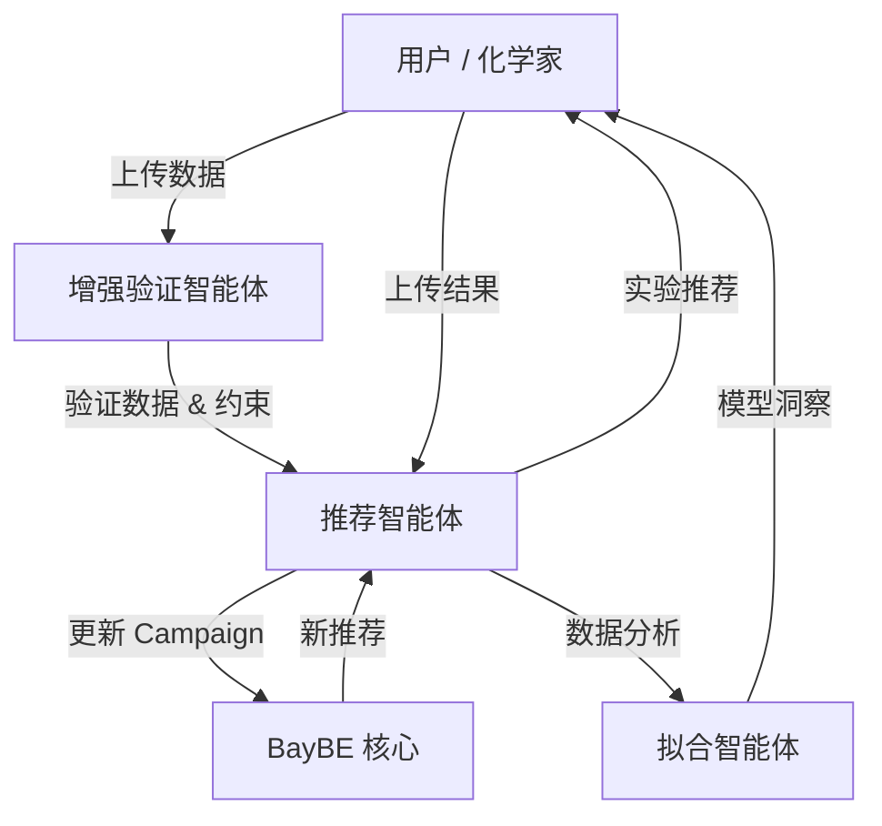
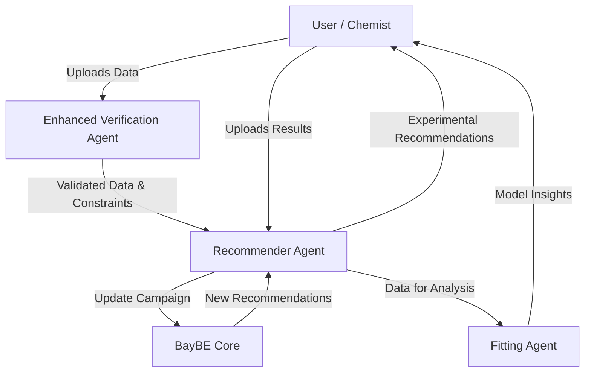

# BoMAS Agent 🧪🤖

[](https://www.python.org/downloads/release/python-3120/)
[](https://developers.google.com/adk)
[](https://github.com/emdgroup/baybe)
[](LICENSE)

[中文](#bomas-项目描述) | [English](#bomas-project-description)

---

<a id="bomas-项目描述"></a>

# BoMAS 项目描述

**BoMAS** (Chemical Bayesian Optimization Multi-Agent System) 是一个基于 **Google Agent Development Kit (ADK)** 和 **BayBE** 贝叶斯优化框架构建的智能化学实验优化系统。该系统通过多智能体协作架构，实现从数据验证、SMILES分子结构处理、实验条件推荐、结果分析到持续迭代优化的完整闭环工作流程。

系统内置化学知识库，能够为实验参数提供专业的边界建议和安全约束，支持单目标、多目标和帕累托前沿优化。通过贝叶斯优化算法，BoMAS能够以最少的实验次数找到最优实验条件，特别适用于环氧固化反应、聚合反应、催化合成、材料配方和工艺参数等化学实验优化场景。

### 与传统方法的区别

| 特性 | 传统 DOE | 传统 BO 库 | BoMAS |
|------|----------|-----------|-------|
| 实验设计 | 一次性固定设计（全因子/正交） | 序贯自适应 | 序贯自适应 + 智能边界建议 |
| 用户交互 | 需统计学背景 | 需编程能力 | 自然语言对话 |
| 数据验证 | 手动检查 | 无/手动 | 自动质量门控 |
| 约束处理 | 手动建模 | 代码硬编码 | 自动检测 + 用户确认 |
| 可复现性 | 依赖文档 | 依赖代码版本 | 完整上下文记录 |

### 为什么 BO 优化需要 AI Agent？

传统 BO 库以"黑箱"形式提供，用户需手动完成数据预处理、参数配置、结果解读等环节。**引入 AI Agent 的核心价值**：

| 传统 BO 库 | BoMAS (AI Agent 驱动) |
|------------|----------------------|
| 用户需手动编写代码调用 API | 自然语言交互，零代码上手 |
| 参数边界/约束需硬编码 | Agent 结合知识库自动建议 |
| 采集函数需专业知识选择 | Agent 根据优化阶段自适应推荐 |
| 数据质量问题导致优化失败 | 验证智能体自动拦截问题数据 |
| 约束冲突需人工排查 | Agent 自动检测并提示修正 |
| 结果解读需额外脚本 | 自动生成轨迹图、特征重要性 |

**技术细节**：
- **采集函数自适应**：根据轮次与改进幅度在探索型（qUCB）与利用型（qEI）间动态切换
- **约束自动生成**：比例列自动生成"和为1"约束，温度列自动施加安全上限
- **数据质量门控**：检测表头污染、非数字字符、SMILES有效性、目标值异常
- **上下文记忆**：维护完整优化历史，便于复现与审计
- **错误恢复**：推荐失败时给出明确修复建议

## 🚀 核心特点

*   **🤖 多智能体协作**：4个专业化智能体协同工作，实现全流程自动化。
*   **🧪 智能实验推荐**：基于BayBE贝叶斯优化框架，高效探索实验空间。
*   **🧠 智能边界建议**：内置化学知识库，为实验参数提供合理的边界建议和安全约束。
*   **📊 多目标优化**：支持单目标、多目标和帕累托前沿优化。
*   **🔄 自适应策略**：根据优化进展动态调整推荐策略（探索 vs 利用）。
*   **📈 结果可视化**：提供模型性能分析、特征重要性和收敛性分析。
*   **🛡️ 智能验证**：自动验证数据质量、CSV表头污染拦截和SMILES分子结构有效性。
*   **📝 统一数据管理**：自动管理实验记录表，追踪实验状态。

## 🛠️ 架构设计

BoMAS采用了一套模块化的参数边界推荐架构：



### 智能参数顾问

```
[知识库 (KB)] --(硬约束)--> [顾问]
[RDKit 工具]  --(分子属性)--> [顾问] --> [用户确认] --> [BayBE SearchSpace]
[LLM]        --(意图 & 上下文)--> [顾问]
```

## ⚡ 快速开始

### 前置要求

*   Python 3.12+
*   Google ADK

### 安装步骤

1.  **克隆与设置**：
    ```bash
    git clone https://github.com/githuweeee/ChemBoMAS.git
    cd ChemBoMAS
    python -m venv .venv
    source .venv/bin/activate  # Windows: .\.venv\Scripts\Activate.ps1
    ```

2.  **安装依赖**：
    ```bash
    pip install -r requirements.txt
    ```

3.  **配置环境**：
    创建 `.env` 文件：
    ```ini
    GOOGLE_API_KEY=your_api_key
    LOG_LEVEL=INFO
    ```

### 启动 Agent

**默认 (Localhost:8000)**:
```bash
adk web
```

**自定义端口 / 外部访问**:
```bash
# 允许在 8080 端口外部访问
adk web --host 0.0.0.0 --port 8080
```

> **注意**: BayBE 自带遥测功能，如需禁用 BayBE 遥测，请在运行前设置 `BAYBE_DISABLE_TELEMETRY=1`。

## 📖 使用指南

1.  **启动会话**：启动 Web 界面并上传您的初始实验数据 (CSV)。**增强验证智能体**将验证您的数据并建议参数边界。
2.  **获取推荐**：Agent 将构建 BayBE Campaign 并生成第一批实验条件。
3.  **执行实验并上传**：下载提供的模板或使用统一的 `experiment_log.csv`。填写结果并上传回聊天界面。
4.  **分析与迭代**：系统自动更新模型。您可以随时请求可视化或检查收敛状态。

### 初始实验数据 CSV 规范

- **文件格式**：仅支持 `.csv`，建议 UTF-8 / UTF-8-SIG 编码。
- **列名要求**：全英文、无空格/中文标点/说明文字；禁止 `Unnamed: 0` 等无名列。
- **表头清洁**：不要把范围或说明写进表头（如 `ratio[0,1]`、含“最大化/最小化/每批/约束”等）。
- **目标列命名**：必须以 `Target_` 开头（如 `Target_yield`）。
- **数值列**：必须为纯数字（不能带单位、百分号、中文描述或占位符）。
- **SMILES 列**：列名包含 `SMILE`（大小写不敏感）会被视为 SMILES 列；必须是有效 SMILES。
- **名称列**：列名包含 `name` 会被识别，可用于纠正无效 SMILES。
- **缺失值**：参数列/目标列尽量不留空，否则可能被过滤或导致验证失败。

## 📂 文档
详细文档请参阅
- `快速开始指南.md` - 快速入门教程
---

<a id="bomas-project-description"></a>

# BoMAS Project Description

**BoMAS** (Chemical Bayesian Optimization Multi-Agent System) is an intelligent chemical experiment optimization system built on the **Google Agent Development Kit (ADK)** and the **BayBE** Bayesian optimization framework. The system employs a multi-agent collaborative architecture to achieve a complete closed-loop workflow from data validation, SMILES molecular structure processing, experimental condition recommendation, result analysis, to continuous iterative optimization.

With a built-in chemistry knowledge base, the system provides professional boundary suggestions and safety constraints for experimental parameters, supporting single-objective, multi-objective, and Pareto frontier optimization. Through Bayesian optimization algorithms, ChemBoMAS can find optimal experimental conditions with minimal experiments, making it particularly suitable for optimization scenarios such as epoxy curing reactions, polymerization reactions, catalytic synthesis, material formulation, and process parameter optimization.

## 🚀 Key Features

*   **🤖 Multi-Agent Collaboration**: Four specialized agents work together to achieve full process automation.
*   **🧪 Intelligent Recommendation**: Efficiently explores the experimental space based on the BayBE Bayesian optimization framework.
*   **🧠 Intelligent Boundaries**: Built-in chemistry knowledge base provides reasonable boundary suggestions and safety constraints for experimental parameters.
*   **📊 Multi-Objective Optimization**: Supports single-objective, multi-objective, and Pareto frontier optimization.
*   **🔄 Adaptive Strategy**: Dynamically adjusts recommendation strategies (exploration vs. exploitation) based on optimization progress.
*   **📈 Result Visualization**: Provides model performance analysis, feature importance, and convergence analysis.
*   **🛡️ Intelligent Verification**: Automatically validates data quality, intercepts CSV header pollution, and checks SMILES validity.
*   **📝 Unified Data Management**: Automatically manages experimental logs and tracks experiment status.

## 🛠️ Architecture

ChemBoMAS employs a modular architecture for parameter boundary recommendation:



### Intelligent Parameter Advisor

```
[Knowledge Base] --(Hard Constraints)--> [Advisor]
[RDKit Tools]    --(Molecule Props)----> [Advisor] --> [User Confirmation] --> [BayBE SearchSpace]
[LLM]            --(Intent & Context)--> [Advisor]
```

## ⚡ Quick Start

### Prerequisites

*   Python 3.12+
*   Google ADK

### Installation

1.  **Clone & Setup**:
    ```bash
    git clone https://github.com/githuweeee/ChemBoMAS.git
    cd ChemBoMAS
    python -m venv .venv
    source .venv/bin/activate  # Windows: .\.venv\Scripts\Activate.ps1
    ```

2.  **Install Dependencies**:
    ```bash
    pip install -r requirements.txt
    ```

3.  **Configure Environment**:
    Create a `.env` file:
    ```ini
    GOOGLE_API_KEY=your_api_key
    LOG_LEVEL=INFO
    ```

### Running the Agent

**Default (Localhost:8000)**:
```bash
adk web
```

**Custom Port / External Access**:
```bash
# Allow external access on port 8080
adk web --host 0.0.0.0 --port 8080
```

> **Note**: To disable BayBE telemetry, set `BAYBE_DISABLE_TELEMETRY=1` before running.

## 📖 Usage Guide

1.  **Start Session**: Launch the Web interface and upload your initial experiment data (CSV). The **Enhanced Verification Agent** will validate your data and suggest parameter boundaries.
2.  **Get Recommendations**: The Agent will build a BayBE Campaign and generate the first batch of experimental conditions.
3.  **Run Experiments & Upload**: Download the provided template or use the unified `experiment_log.csv`. Fill in results and upload back to the chat interface.
4.  **Analyze & Iterate**: The system automatically updates the model. You can request visualization or check convergence status at any time.

### Initial Experimental Data CSV Specifications  
- **File Format**: Only `.csv` is supported, with UTF-8 / UTF-8-SIG encoding recommended.  
- **Column Name Requirements**: Must be in English only, without spaces/Chinese punctuation/explanatory text; unnamed columns like `Unnamed: 0` are prohibited.  
- **Clean Headers**: Do not include ranges or descriptions in headers (e.g., `ratio[0,1]`, or terms like "maximize/minimize/per batch/constraint").  
- **Target Column Naming**: Must start with `Target_` (e.g., `Target_yield`).  
- **Numeric Columns**: Must contain pure numbers (no units, percentage signs, Chinese descriptions, or placeholders).  
- **SMILES Column**: Columns with names containing `SMILE` (case-insensitive) will be treated as SMILES columns; must contain valid SMILES strings.  
- **Name Column**: Columns with names containing `name` will be recognized and can be used to correct invalid SMILES.  
- **Missing Values**: Parameter/target columns should avoid empty cells, as they may be filtered or cause validation failures. 

## 📂 Documentation 
For detailed documentation, please refer to
- `Quick Start Guide.md` - Quick Start Tutorial

## 📄 License

This project is licensed under the **GNU Affero General Public License v3.0 (AGPLv3)** - see the [LICENSE](LICENSE) file for details.

This means that if you run a modified version of this software as a network service (e.g., as a web application or SaaS), you must disclose the source code to the users of that service.

本项目采用 **GNU Affero 通用公共许可证 v3.0 (AGPLv3)** 授权。

这意味着，如果您将本软件的修改版本作为网络服务运行（例如作为 Web 应用程序或 SaaS），您必须向该服务的用户公开源代码。基于此项目进行的开发都需要开源。
